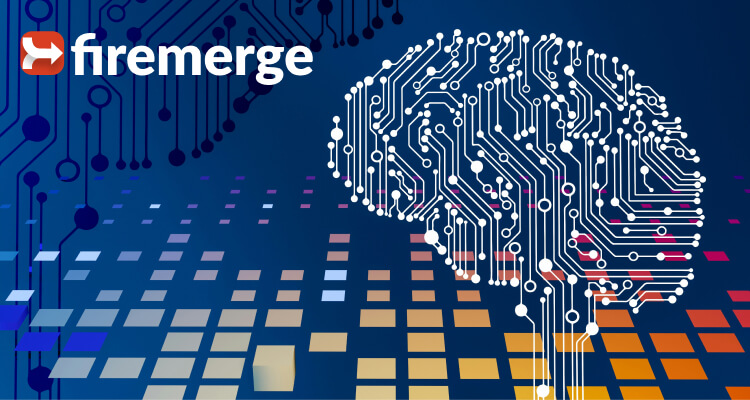

# Introducing Firemerge: Revolutionizing Financial Operations with Seamless Integration

Welcome to the dawn of a new era in financial management—where the complexity of financial operations meets the simplicity and power of technology. Today, we're excited to introduce Firemerge, a cutting-edge platform designed to transform how businesses manage, analyze, and integrate their financial data.

### **Unified Financial Document Management**

Gone are the days of juggling multiple formats and systems for your financial documents. Firemerge brings everything into one place, providing a seamless, organized environment for all your financial documents. Say goodbye to lost files and hello to effortless management.

### **Automated OCR & Text Extraction**

Firemerge harnesses the latest in Optical Character Recognition (OCR) technology and text extraction to automate the processing of documents. Whether it's a scanned receipt or a digital invoice, our platform converts images to editable, searchable text, streamlining data entry and minimizing errors.

### **Advanced NLP for Financial Insights**

Our platform doesn't just organize your data; it understands it. With advanced Natural Language Processing (NLP), Firemerge offers deeper insights into your financial documents. From trend analysis to predictive forecasts, unlock the stories your data tells.

### **Seamless Third-Party Integrations**

Efficiency is key to financial management, and Firemerge's seamless integrations with popular accounting software, CRM systems, and other business tools ensure your workflow is uninterrupted. Connect your existing platforms with ease and keep your data flowing smoothly across your ecosystem.

### **Custom Workflow Automation**

Every business is unique, and so are its processes. Firemerge's custom workflow automation allows you to design and implement the workflows that best fit your business needs, enhancing productivity and ensuring that your financial operations run like clockwork.

### **Real-Time Financial Reporting & Secure Data Encryption**

With Firemerge, real-time financial reporting is at your fingertips. Make informed decisions with up-to-date reports and analyses. Moreover, your data's security is our top priority. Rest assured, knowing your sensitive financial information is protected with industry-leading encryption technologies.

### **Ready to Transform Your Financial Operations?**

Firemerge is more than just a tool; it's your partner in financial management. By automating and integrating your financial operations, Firemerge not only saves you time but also provides valuable insights that can help propel your business forward.

Stay tuned to our blog for more updates, tips, and insights on how to make the most of Firemerge. We're here to help you navigate the complexities of financial management with ease and confidence. Welcome to the future of financial operations.

---

For more information, visit our website at [www.firemerge.ai](https://www.firemerge.ai), and let's embark on this transformative journey together. Your path to simplified, efficient, and secure financial operations starts with Firemerge.
